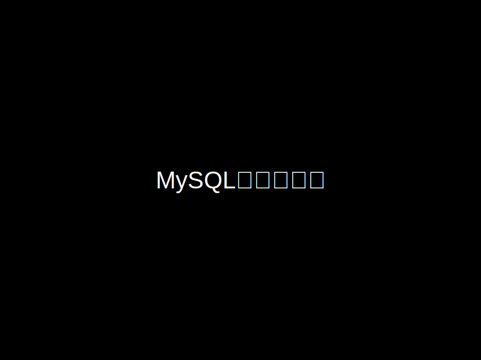

# MySQLのダウンロード手順

---

## 1. MySQLの公式サイトにアクセス

- 検索エンジンで「MySQL」を検索し、公式サイトを開く

---

## 2. ダウンロードページへ移動

- ページ上部の「ダウンロード」をクリック
- 「MySQL Community (GPL) Downloads」を選択
- 「MySQL Community Server」を選択

---

## 3. LTSバージョンの選択

- 「Select Version」から「8.4.1 LTS」を選択
  
注：バージョン番号は変更される可能性があります。LTSと表示されているものを選んでください。

---

## 4. Windowsインストーラーのダウンロード

- 「Select Operating System」で「Microsoft Windows」を選択
- 「Windows (x86, 64-bit), MSI Installer」の「Download」ボタンをクリック

---

## 5. ダウンロードの開始

- 「No thanks, just start my download.」を選択してダウンロードを開始

---

## 注意

ダウンロードしたインストーラーファイルは、後でインストールに使用するので削除しないでください。

