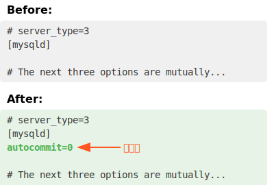
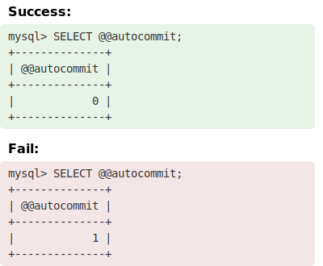
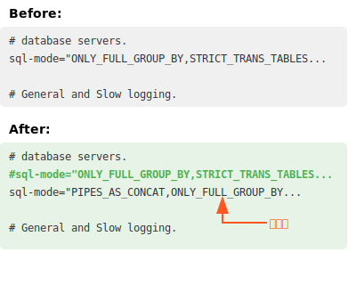
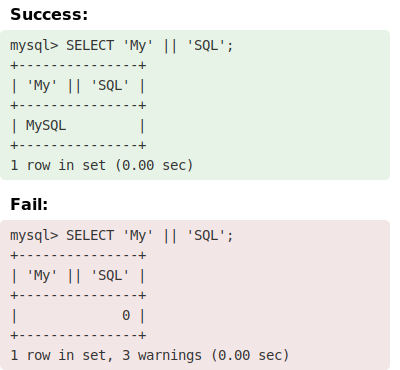

# 3. MySQLの設定変更

ナビゲーション:

- 次のスライド: 右矢印キー / スペース
- 前のスライド: 左矢印キー
- 最初のスライド: Home キー
- 最後のスライド: End キー

---

## 3.1 はじめに

このセクションでは、職業訓練向けのMySQL設定変更手順を説明します。対象バージョンはMySQL 8.4.2 LTS です。

---

## 3.2 目的

1. データ操作言語（DML）、特にSELECT文の学習に適した環境を整える。
2. 実務により近い設定でMySQLを使用できるようにする。

---

## 3.3 重要な変更点 (1/2)

1. **オートコミットの無効化**:
   - 目的：変更が即座に反映されないようにし、トランザクションの概念を学ぶ。
   - 効果：SELECT, INSERT, UPDATE, DELETE の結果を確認してから、明示的にコミットする習慣を身につける。

---

## 3.3 重要な変更点 (2/2)

2. **連結演算子 `||` の有効化**:
   - 目的：他の主要なRDBMS（例：Oracle, PostgreSQL）と同様の文法で文字列を連結できるようにする。
   - 効果：異なるデータベース間でのSQL文の移植性を高める。

これらの設定変更により、実際の業務環境により近い形でSQLを学ぶことができます。また、トランザクション管理の基本も体験できるようになります。

---

## 3.4 設定ファイルの場所

| ファイル名 | パス                                   |
| ---------- | -------------------------------------- |
| my.ini     | C:\ProgramData\MySQL\MySQL Server 8.4   |

注意: `ProgramData` フォルダは通常隠しフォルダになっています。表示されない場合は、エクスプローラーの「表示」タブで「隠しファイル」にチェックを入れてください。

---

## 3.5 設定ファイルのバックアップ

設定を変更する前に、必ず現在の設定ファイルのバックアップを作成してください。以下の手順で簡単にバックアップを作成できます：

1. エクスプローラーで設定ファイルのある場所に移動します：
   `C:\ProgramData\MySQL\MySQL Server 8.4`
1. `my.ini` ファイルを右クリックし、「コピー」を選択します。
1. 同じフォルダ内で右クリックし、「貼り付け」を選択します。
1. 新しくコピーされたファイルの名前を `my.ini.backup` に変更します。

これで、元の設定に戻したい場合は、バックアップファイルの名前を `my.ini` に戻し、変更したファイルと置き換えるだけで済みます。

---

## 3.6 MySQLサービスの再起動

設定ファイルを変更した後、変更を反映させるためにMySQLサービスを再起動する必要があります。以下の手順で再起動を行います：

1. Windowsの検索バーに「サービス」と入力し、「サービス」アプリを開きます。
1. サービスの一覧から「MySQL84」（または同様のMySQLサービス名）を探します。
1. 「MySQL84」を右クリックし、「再起動」を選択します。
1. サービスが停止し、その後再起動されるまで待ちます。
1. ステータスが「実行中」になったことを確認します。

注意：サービスの再起動には管理者権限が必要な場合があります。権限がない場合は、システム管理者に依頼してください。

---

## 3.7 オートコミットを無効にする

設定ファイルの`[mysqld]`セクションに`autocommit=0`を追加して、オートコミットを無効にします。

注: コメント行は省略されています。実際の設定ファイルでは完全な行が記述されています。

---

## 3.7.1 オートコミット無効の動作確認

MySQL 8.4 Command Line Client - Unicode で`SELECT @@autocommit`を実行し、以下の表示になれば成功です。

注: 下の例のように結果が `1` の場合、設定が正しく適用されていません。

---

## 3.8 `||`を連結演算子として使えるようにする

`SQL Mode`に`PIPES_AS_CONCAT`を追加する。元の記述をコピーして、すぐ下にペーストする。元の記述はコメントアウトする。新たに作成したほうの先頭に`PIPES_AS_CONCAT,`を追加する。

---

## 3.8.1 `||`の動作確認

MySQL 8.4 Command Line Client - Unicode で`SELECT 'My' || 'SQL'`を実行し、以下の表示になれば成功です。

注: 下の例のように結果が `0` の場合、設定が正しく適用されていません。

---

## まとめ

- オートコミットの無効化と`PIPES_AS_CONCAT`の有効化方法を学びました
- 設定変更前のバックアップの重要性
- 変更後のサービス再起動の必要性
- 各変更後の動作確認の重要性

注意: 設定を変更する前に、必ず現在の設定をバックアップしてください。
